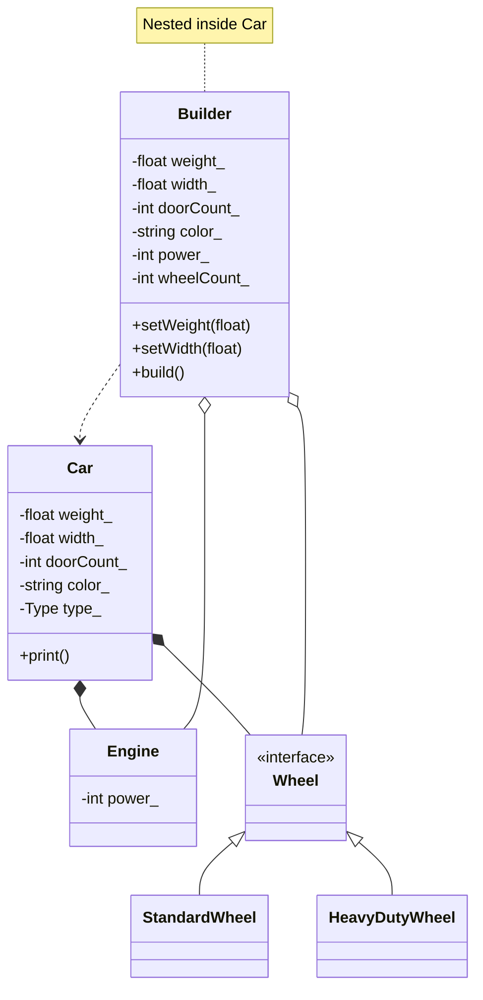

# Builder Pattern (Dynamic)



### Symbology Reference

```mermaid
graph LR
    A[Class A] --|> B[Class B] -- Inheritance_Public
```

```mermaid
graph LR
    C[Class A] *-- D[Class B] -- Composition_Ownership
```

```mermaid
graph LR
    E[Class A] o-- F[Class B] -- Aggregation_PreBuildData
```

```mermaid
graph LR
    G[Class A] ..> H[Class B] -- Dependency_CreatesInstance
```
