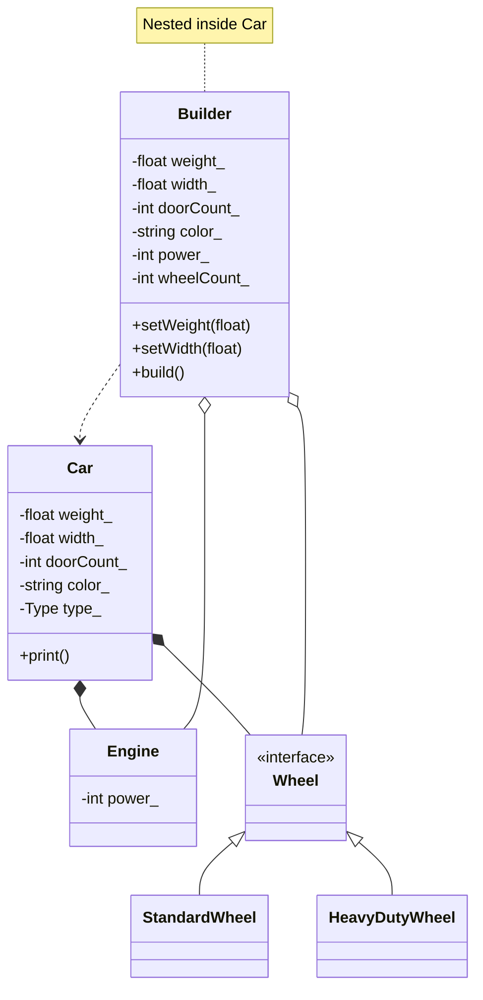
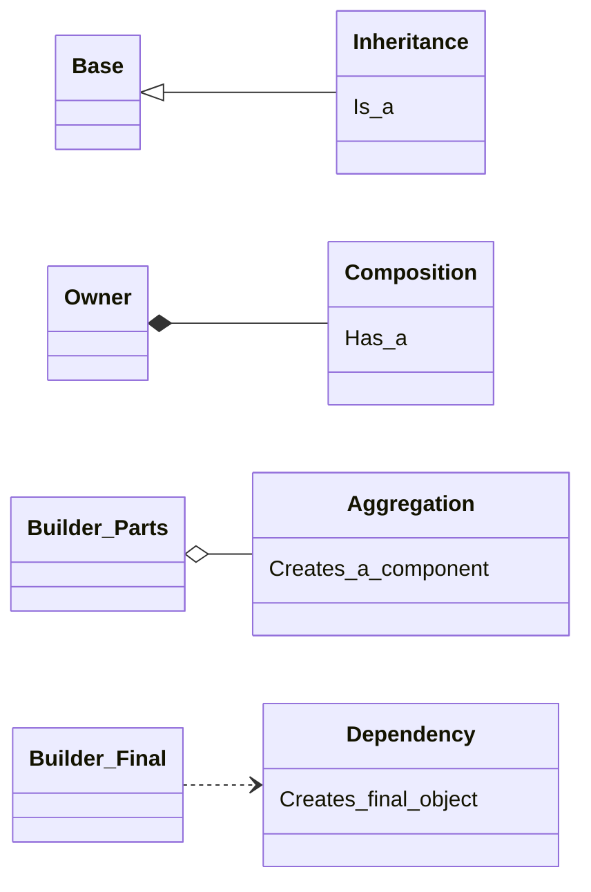

```mermaid
classDiagram
    class Engine { -int power_ }
    class Wheel { <<interface>> }
    class StandardWheel
    class HeavyDutyWheel
    
    class Car {
        -float weight_
        -float width_
        -int doorCount_
        -string color_
        -Type type_
        +print()
    }

    class Builder {
        -float weight_
        -float width_
        -int doorCount_
        -string color_
        -int power_
        -int wheelCount_
        +setWeight(float)
        +setWidth(float)
        +build()
    }

    Wheel <|-- StandardWheel
    Wheel <|-- HeavyDutyWheel
    Car *-- Engine
    Car *-- Wheel
    Builder o-- Engine
    Builder o-- Wheel
    Builder ..> Car
    note for Builder "Nested inside Car"
```

### Symbology Reference

```mermaid
classDiagram
    direction LR
    class Inheritance { Is_a }
    class Composition { Has_a }
    class Aggregation { Creates_a_component }
    class Dependency { Creates_final_object }

    Base <|-- Inheritance
    Owner *-- Composition
    Builder_Parts o-- Aggregation
    Builder_Final ..> Dependency
```
