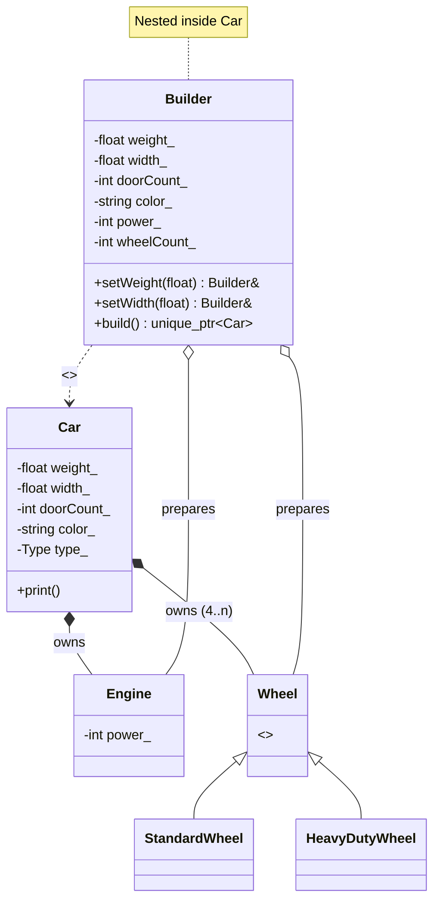

```mermaid
classDiagram
class Engine {
-int power_
}
class Wheel {
<>
}
class StandardWheel
class HeavyDutyWheel
class Car {
-float weight_
-float width_
-int doorCount_
-string color_
-Type type_
+print()
}
class Builder {
-float weight_
-float width_
-int doorCount_
-string color_
-int power_
-int wheelCount_
+setWeight(float) Builder&
+setWidth(float) Builder&
+build() unique_ptr~Car~
}
%% Inheritance (Solid line, empty arrow)
Wheel <|-- StandardWheel
Wheel <|-- HeavyDutyWheel
%% Composition (Solid line, filled diamond) - Represents unique_ptr ownership
Car *-- Engine : owns
Car *-- Wheel : owns (4..n)
%% Aggregation (Solid line, empty diamond) - Builder prepares components
Builder o-- Engine : prepares
Builder o-- Wheel : prepares
%% Dependency (Dashed line, open arrow) - Builder creates the final object
Builder ..> Car : <>
note for Builder "Nested inside Car"
```
