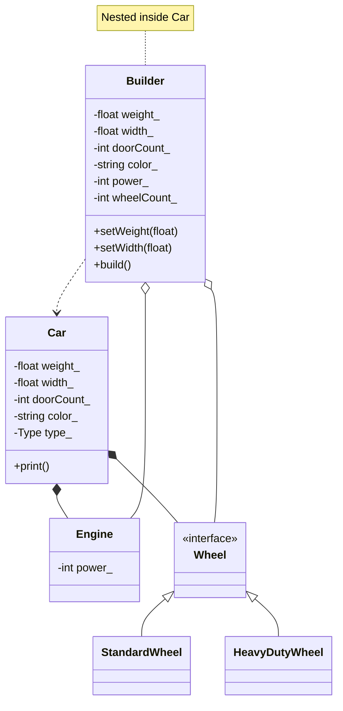

# Builder Pattern (Dynamic)



### Symbology Reference

```mermaid
graph LR
    A[Class A] --|> B[Class B]
    style A fill:none,stroke:none
    style B fill:none,stroke:none
    text1(Inheritance / public)
    style text1 fill:none,stroke:none
```

```mermaid
graph LR
    C[Class A] *-- D[Class B]
    style C fill:none,stroke:none
    style D fill:none,stroke:none
    text2(Composition / unique_ptr ownership)
    style text2 fill:none,stroke:none
```

```mermaid
graph LR
    E[Class A] o-- F[Class B]
    style E fill:none,stroke:none
    style F fill:none,stroke:none
    text3(Aggregation / Pre-build data)
    style text3 fill:none,stroke:none
```

```mermaid
graph LR
    G[Class A] ..> H[Class B]
    style G fill:none,stroke:none
    style H fill:none,stroke:none
    text4(Dependency / creates instance)
    style text4 fill:none,stroke:none
```
