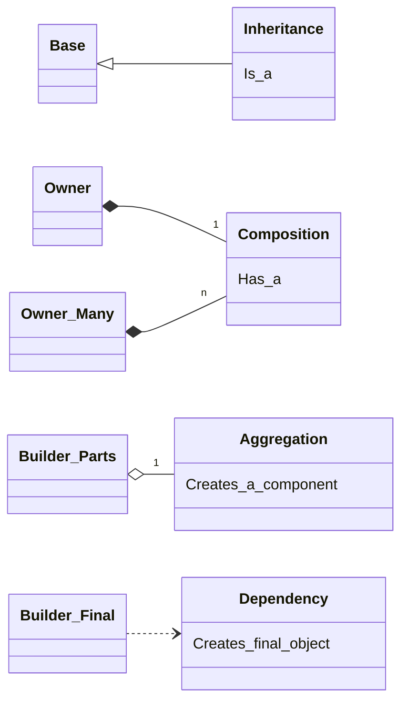

# Builder Pattern (Dynamic)

```mermaid
classDiagram
   class Engine { -int power_ }
   class Wheel { <<interface>> }
   class StandardWheel
   class HeavyDutyWheel
   
   class Car {
      -float weight_
      -float width_
      -int doorCount_
      -string color_
      -Type type_
      -unique_ptr~Engine~ engine_
      -vector~unique_ptr~Wheel~~ wheels_
      +print()
   }

   class Builder {
      -float weight_
      -float width_
      -int doorCount_
      -string color_
      -int power_
      -int wheelCount_
      +setWeight(float) Builder&
      +build() unique_ptr~Car~
   }

   Wheel <|-- StandardWheel
   Wheel <|-- HeavyDutyWheel
   
   %% Relations with multiplicity only at the end
   Car *-- "1" Engine
   Car *-- "n" Wheel
   
   Builder o-- "1" Engine
   Builder o-- "n" Wheel
   
   Builder ..> Car
   note for Builder "Nested inside Car"
```

### Symbology Reference

```mermaid
classDiagram
   direction LR
   class Inheritance { Is_a }
   class Composition { Has_a }
   class Aggregation { Creates_a_component }
   class Dependency { Creates_final_object }

   Base <|-- Inheritance
   Owner *-- "1" Composition
   Owner_Many *-- "n" Composition
   Builder_Parts o-- "1" Aggregation
   Builder_Final ..> Dependency
```

================================================================================ END
