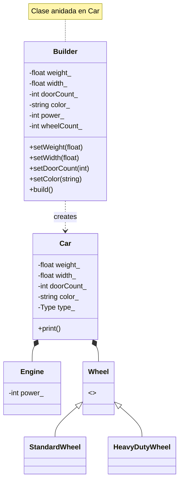

```mermaid
classDiagram
class Engine {
-int power_
}
class Wheel {
<>
}
class StandardWheel
class HeavyDutyWheel
class Car {
-float weight_
-float width_
-int doorCount_
-string color_
-Type type_
+print()
}
class Builder {
-float weight_
-float width_
-int doorCount_
-string color_
-int power_
-int wheelCount_
+setWeight(float)
+setWidth(float)
+setDoorCount(int)
+setColor(string)
+build()
}
Wheel <|-- StandardWheel
Wheel <|-- HeavyDutyWheel
Car *-- Engine
Car *-- Wheel
Builder ..> Car : creates
note for Builder "Clase anidada en Car"
```
