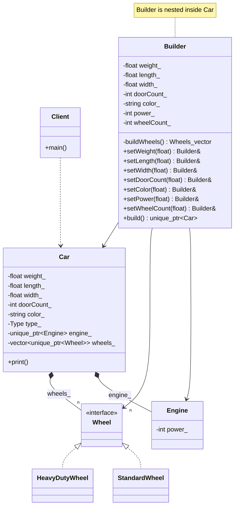

# Builder Pattern (Dynamic)

```mermaid
classDiagram
   class Client { +main() }

   class Engine { -int power_ }
   class Wheel { <<interface>> }
   class StandardWheel
   class HeavyDutyWheel
   
   class Car {
      -float weight_
      -float length_
      -float width_
      -int doorCount_
      -string color_
      -Type type_
      -unique_ptr~Engine~ engine_
      -vector~unique_ptr~Wheel~~ wheels_

      +print()
   }

   class Builder {
      -float weight_
      -float length_
      -float width_
      -int doorCount_
      -string color_
      -int power_
      -int wheelCount_

      -buildWheels() Wheels_vector
      +setWeight(float) Builder&
      +setLength(float) Builder&
      +setWidth(float) Builder&
      +setDoorCount(float) Builder&
      +setColor(float) Builder&
      +setPower(float) Builder&
      +setWheelCount(float) Builder&
      +build() unique_ptr~Car~
   }

   Wheel <|.. StandardWheel
   Wheel <|.. HeavyDutyWheel
   
   %% Relations
   Car *-- Engine : engine_
   Car *-- "n" Wheel : wheels_
   
   Builder --> Engine
   Builder --> "n" Wheel
   Builder --> Car

   note for Builder "Builder is nested inside Car"

   Client ..> Car
```
