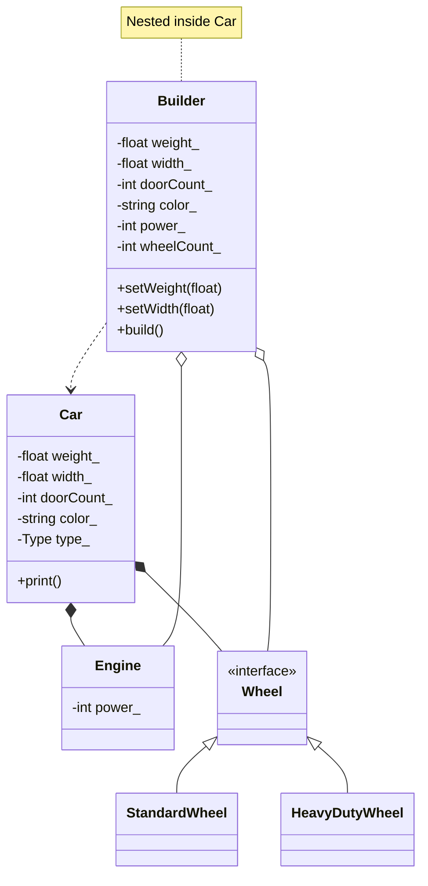

### Symbology Reference

| Symbol | Meaning | C++ Implementation |
| :--- | :--- | :--- |
| **` <|-- `** | **Inheritance** | `public Wheel` |
| **` *--  `** | **Composition** | `std::unique_ptr` (Ownership) |
| **` o--  `** | **Aggregation** | Configuration / Pre-build data |
| **` ..>  `** | **Dependency** | `build()` method creates `Car` |
