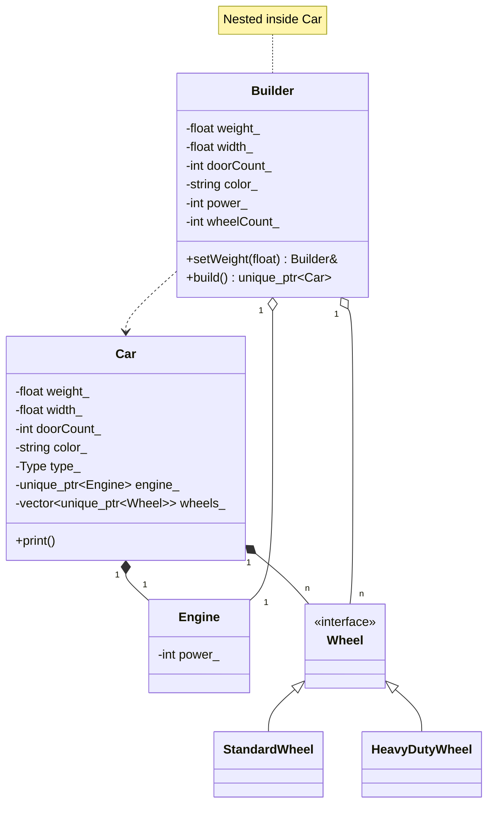
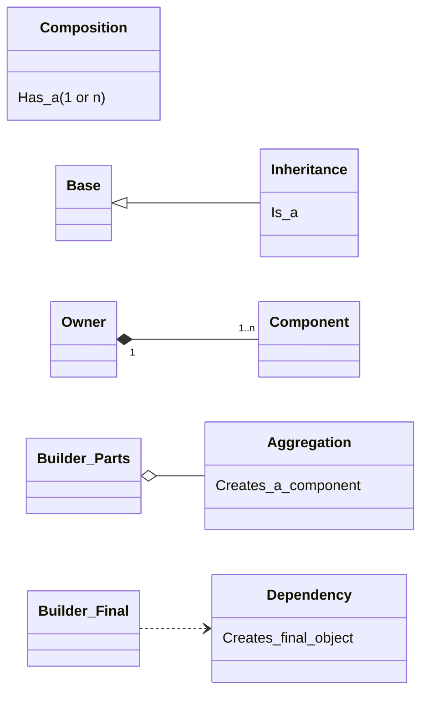

# Builder Pattern (Dynamic)

```mermaid
classDiagram
    class Engine { -int power_ }
    class Wheel { <<interface>> }
    class StandardWheel
    class HeavyDutyWheel
    
    class Car {
        -float weight_
        -float width_
        -int doorCount_
        -string color_
        -Type type_
        -unique_ptr~Engine~ engine_
        -vector~unique_ptr~Wheel~~ wheels_
        +print()
    }

    class Builder {
        -float weight_
        -float width_
        -int doorCount_
        -string color_
        -int power_
        -int wheelCount_
        +setWeight(float) Builder&
        +build() unique_ptr~Car~
    }

    Wheel <|-- StandardWheel
    Wheel <|-- HeavyDutyWheel
    
    %% Multiplicity: 1 Engine, n Wheels
    Car "1" *-- "1" Engine
    Car "1" *-- "n" Wheel
    
    %% The Builder temporary aggregation
    Builder "1" o-- "1" Engine
    Builder "1" o-- "n" Wheel
    
    Builder ..> Car
    note for Builder "Nested inside Car"
```

### Symbology Reference

```mermaid
classDiagram
    direction LR
    class Inheritance { Is_a }
    class Composition { Has_a (1 or n) }
    class Aggregation { Creates_a_component }
    class Dependency { Creates_final_object }

    Base <|-- Inheritance
    Owner "1" *-- "1..n" Component
    Builder_Parts o-- Aggregation
    Builder_Final ..> Dependency
```
