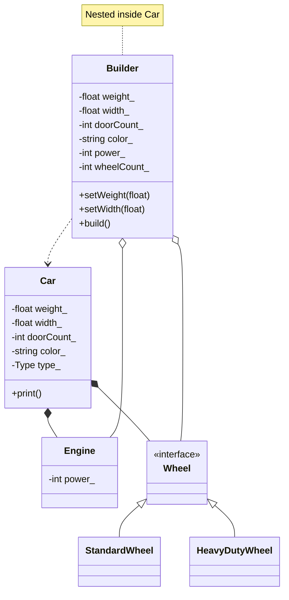

# Builder Pattern (Dynamic)



### Symbology Reference

```mermaid
graph LR
    A[Class A] --|> B[Class B]
    Description1(Inheritance / public)
```

```mermaid
graph LR
    C[Class A] *-- D[Class B]
    Description2(Composition / unique_ptr ownership)
```

```mermaid
graph LR
    E[Class A] o-- F[Class B]
    Description3(Aggregation / Pre-build data)
```

```mermaid
graph LR
    G[Class A] ..> H[Class B]
    Description4(Dependency / creates instance)
```
