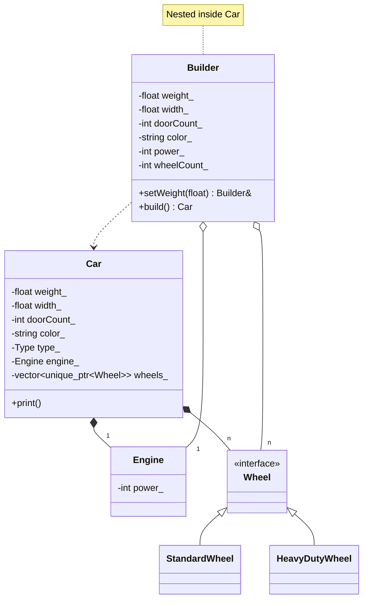

# Builder Pattern (Static)

```mermaid
classDiagram
    class Engine { -int power_ }
    class Wheel { <<interface>> }
    class StandardWheel
    class HeavyDutyWheel
    
    class Car {
        -float weight_
        -float width_
        -int doorCount_
        -string color_
        -Type type_
        -Engine engine_
        -vector~unique_ptr~Wheel~~ wheels_
        +print()
    }

    class Builder {
        -float weight_
        -float width_
        -int doorCount_
        -string color_
        -int power_
        -int wheelCount_
        +setWeight(float) Builder&
        +build() Car
    }

    Wheel <|-- StandardWheel
    Wheel <|-- HeavyDutyWheel
    
    %% Relations with multiplicity only at the end
    Car *-- "1" Engine
    Car *-- "n" Wheel
    
    Builder o-- "1" Engine
    Builder o-- "n" Wheel
    
    Builder ..> Car
    note for Builder "Nested inside Car"
```
