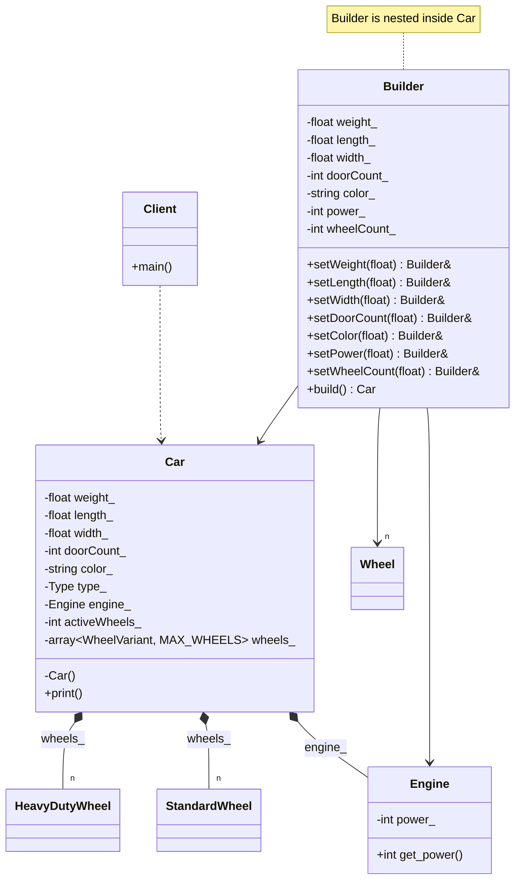

# Builder Pattern (Dynamic)

```mermaid
classDiagram
   class Client { +main() }

   class Engine {
      -int power_
      +int get_power()
   }

   class StandardWheel
   class HeavyDutyWheel
   
   class Car {
      -float weight_
      -float length_
      -float width_
      -int doorCount_
      -string color_
      -Type type_
      -Engine engine_
      -int activeWheels_
      -array~WheelVariant, MAX_WHEELS~ wheels_
      -Car()

      +print()
   }

   class Builder {
      -float weight_
      -float length_
      -float width_
      -int doorCount_
      -string color_
      -int power_
      -int wheelCount_

      +setWeight(float)     Builder&
      +setLength(float)     Builder&
      +setWidth(float)      Builder&
      +setDoorCount(float)  Builder&
      +setColor(float)      Builder&
      +setPower(float)      Builder&
      +setWheelCount(float) Builder&
      +build() Car
   }

   %% Relations
   Car *-- Engine : engine_
   Car *-- "n" StandardWheel : wheels_
   Car *-- "n" HeavyDutyWheel : wheels_
   
   Builder --> Engine
   Builder --> "n" Wheel
   Builder --> Car

   note for Builder "Builder is nested inside Car"

   Client ..> Car
```
