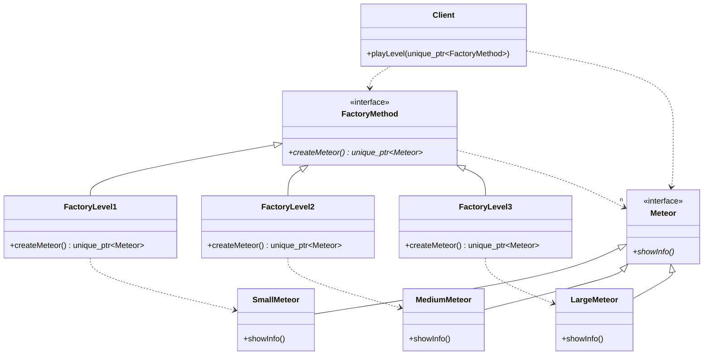

# Factory Method Pattern (GoF)

```mermaid
classDiagram
    class Meteor {
        <<interface>>
        +showInfo()*
    }
    class SmallMeteor {
        +showInfo()
    }
    class MediumMeteor {
        +showInfo()
    }
    class LargeMeteor {
        +showInfo()
    }

    class FactoryMethod {
        <<interface>>
        +createMeteor()* unique_ptr~Meteor~
    }
    class FactoryLevel1 {
        +createMeteor() unique_ptr~Meteor~
    }
    class FactoryLevel2 {
        +createMeteor() unique_ptr~Meteor~
    }
    class FactoryLevel3 {
        +createMeteor() unique_ptr~Meteor~
    }

    class Client {
        +playLevel(unique_ptr~FactoryMethod~)
    }

    Meteor <|-- SmallMeteor
    Meteor <|-- MediumMeteor
    Meteor <|-- LargeMeteor

    FactoryMethod <|-- FactoryLevel1
    FactoryMethod <|-- FactoryLevel2
    FactoryMethod <|-- FactoryLevel3

    %% Concrete creators depend on concrete products
    FactoryLevel1 ..> SmallMeteor
    FactoryLevel2 ..> MediumMeteor
    FactoryLevel3 ..> LargeMeteor

    %% Abstract creator conceptually creates abstract products
    FactoryMethod ..> "n" Meteor

    %% Client uses the abstractions
    Client ..> FactoryMethod
    Client ..> Meteor
```
