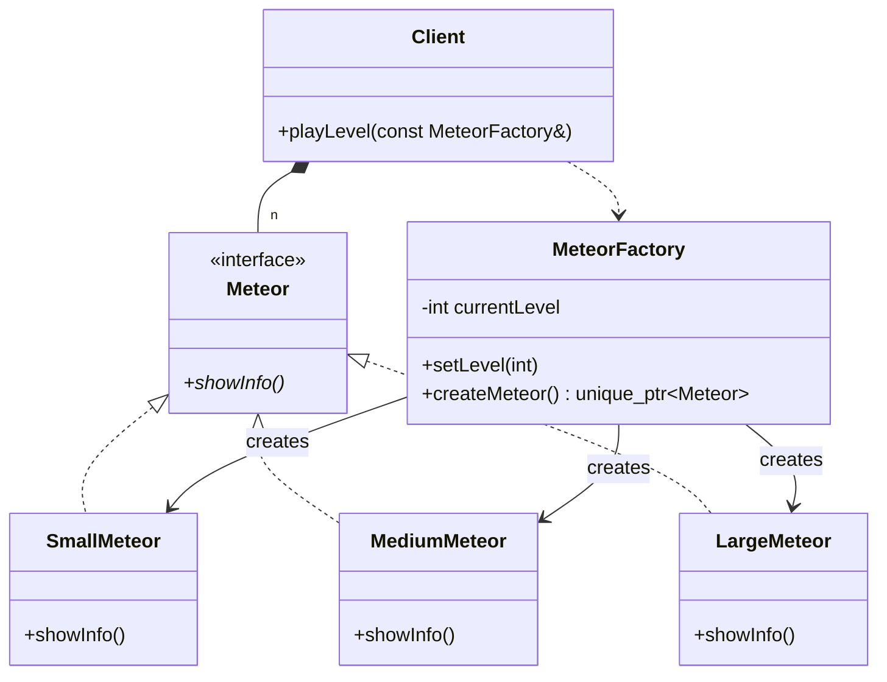

# Simple Factory Method Pattern (Idiom)

```mermaid
classDiagram
    class Meteor {
        <<interface>>
        +showInfo()*
    }
    class SmallMeteor {
        +showInfo()
    }
    class MediumMeteor {
        +showInfo()
    }
    class LargeMeteor {
        +showInfo()
    }

    class MeteorFactory {
        -int currentLevel
        +setLevel(int)
        +createMeteor() unique_ptr~Meteor~
    }

    class Client {
        +playLevel(const MeteorFactory&)
    }

    Meteor <|.. SmallMeteor
    Meteor <|.. MediumMeteor
    Meteor <|.. LargeMeteor

    %% The Factory creates specific concrete products based on its internal state
    MeteorFactory --> SmallMeteor : creates
    MeteorFactory --> MediumMeteor : creates
    MeteorFactory --> LargeMeteor : creates
    
    %% Client relies on the single concrete factory and the abstract product
    Client ..> MeteorFactory
    Client *-- "n" Meteor
```
