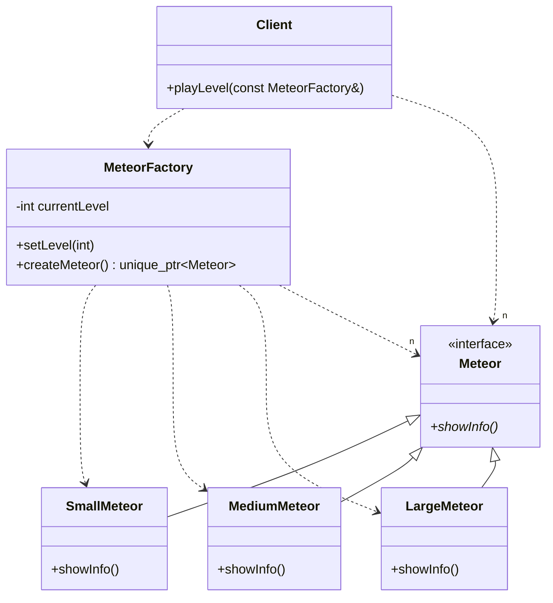
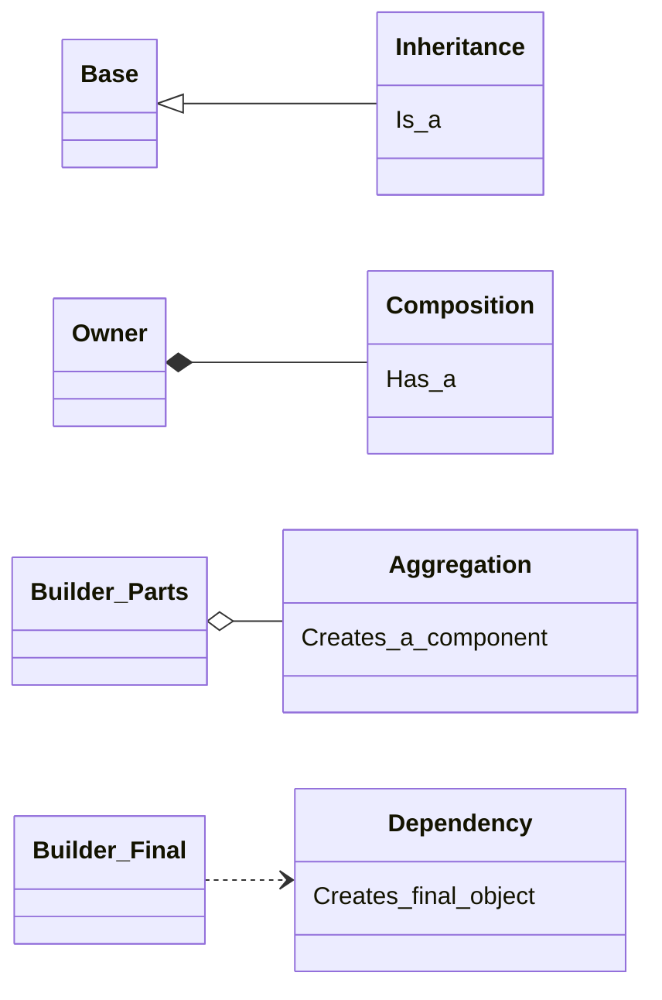

# Simple Factory Method Pattern (Idiom)

```mermaid
classDiagram
    class Meteor {
        <<interface>>
        +showInfo()*
    }
    class SmallMeteor {
        +showInfo()
    }
    class MediumMeteor {
        +showInfo()
    }
    class LargeMeteor {
        +showInfo()
    }

    class MeteorFactory {
        -int currentLevel
        +setLevel(int)
        +createMeteor() unique_ptr~Meteor~
    }

    class Client {
        +playLevel(const MeteorFactory&)
    }

    Meteor <|-- SmallMeteor
    Meteor <|-- MediumMeteor
    Meteor <|-- LargeMeteor

    %% The Factory creates specific concrete products based on its internal state
    MeteorFactory ..> SmallMeteor
    MeteorFactory ..> MediumMeteor
    MeteorFactory ..> LargeMeteor
    
    %% The Factory returns abstract products
    MeteorFactory ..> "n" Meteor

    %% Client relies on the single concrete factory and the abstract product
    Client ..> MeteorFactory
    Client ..> "n" Meteor
```

### Symbology Reference

```mermaid
classDiagram
    direction LR
    class Inheritance { Is_a }
    class Composition { Has_a }
    class Aggregation { Creates_a_component }
    class Dependency { Creates_final_object }

    Base <|-- Inheritance
    Owner *-- Composition
    Builder_Parts o-- Aggregation
    Builder_Final ..> Dependency
```
