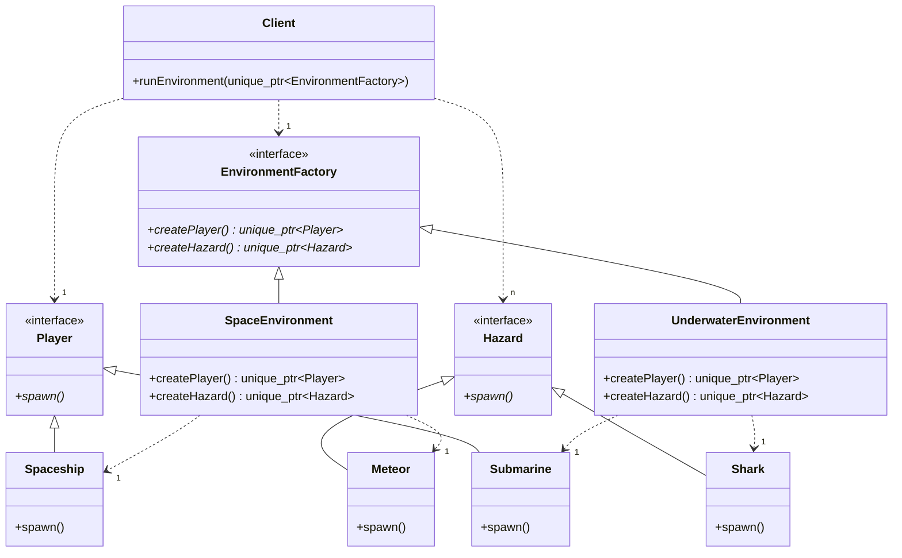
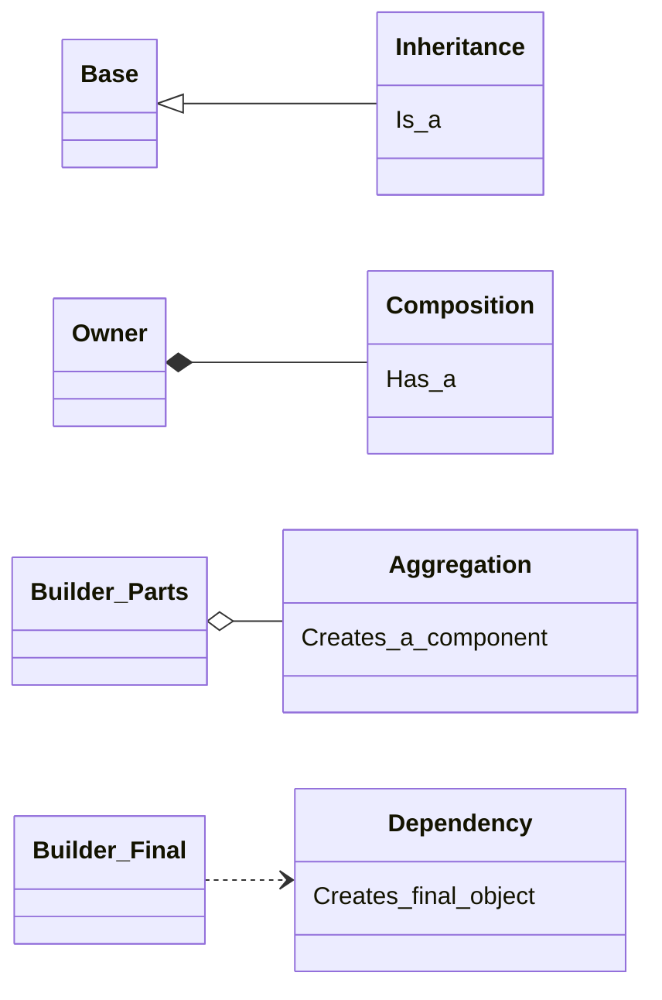

# Abstract Factory Pattern

```mermaid
classDiagram
    class Player {
        <<interface>>
        +spawn()*
    }
    class Hazard {
        <<interface>>
        +spawn()*
    }

    class Spaceship { +spawn() }
    class Meteor { +spawn() }
    class Submarine { +spawn() }
    class Shark { +spawn() }

    class EnvironmentFactory {
        <<interface>>
        +createPlayer()* unique_ptr~Player~
        +createHazard()* unique_ptr~Hazard~
    }

    class SpaceEnvironment {
        +createPlayer() unique_ptr~Player~
        +createHazard() unique_ptr~Hazard~
    }

    class UnderwaterEnvironment {
        +createPlayer() unique_ptr~Player~
        +createHazard() unique_ptr~Hazard~
    }

    class Client {
        +runEnvironment(unique_ptr~EnvironmentFactory~)
    }

    %% Inheritance Relationships
    Player <|-- Spaceship
    Player <|-- Submarine
    Hazard <|-- Meteor
    Hazard <|-- Shark

    EnvironmentFactory <|-- SpaceEnvironment
    EnvironmentFactory <|-- UnderwaterEnvironment

    %% Creation Dependencies (The Families)
    SpaceEnvironment ..> "1" Spaceship
    SpaceEnvironment ..> "1" Meteor
    
    UnderwaterEnvironment ..> "1" Submarine
    UnderwaterEnvironment ..> "1" Shark

    %% Client interacting with abstractions
    Client ..> "1" EnvironmentFactory
    Client ..> "1" Player
    Client ..> "n" Hazard
```

### Symbology Reference

```mermaid
classDiagram
    direction LR
    class Inheritance { Is_a }
    class Composition { Has_a }
    class Aggregation { Creates_a_component }
    class Dependency { Creates_final_object }

    Base <|-- Inheritance
    Owner *-- Composition
    Builder_Parts o-- Aggregation
    Builder_Final ..> Dependency
```
