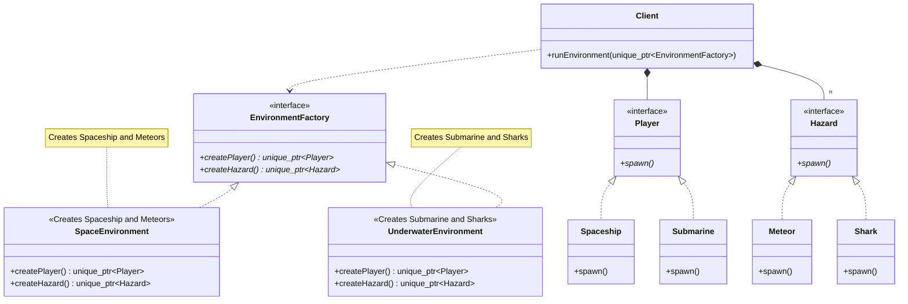

# Abstract Factory Pattern

```mermaid
classDiagram
    class Player {
        <<interface>>
        +spawn()*
    }
    class Hazard {
        <<interface>>
        +spawn()*
    }

    class Spaceship { +spawn() }
    class Meteor { +spawn() }
    class Submarine { +spawn() }
    class Shark { +spawn() }

    class EnvironmentFactory {
        <<interface>>
        +createPlayer()* unique_ptr~Player~
        +createHazard()* unique_ptr~Hazard~
    }

    class SpaceEnvironment {
        <<Creates Spaceship and Meteors>>
        +createPlayer() unique_ptr~Player~
        +createHazard() unique_ptr~Hazard~
    }
    note for SpaceEnvironment "Creates Spaceship and Meteors"

    class UnderwaterEnvironment {
        <<Creates Submarine and Sharks>>
        +createPlayer() unique_ptr~Player~
        +createHazard() unique_ptr~Hazard~
    }
    note for UnderwaterEnvironment "Creates Submarine and Sharks"

    class Client {
        +runEnvironment(unique_ptr~EnvironmentFactory~)
    }

    %% Inheritance Relationships
    Player <|.. Spaceship
    Player <|.. Submarine
    Hazard <|.. Meteor
    Hazard <|.. Shark

    EnvironmentFactory <|.. SpaceEnvironment
    EnvironmentFactory <|.. UnderwaterEnvironment

    %% Client interacting with abstractions
    Client ..> EnvironmentFactory
    Client *-- Player
    Client *-- "n" Hazard

    %% Creation Dependencies (The Families)
    %%SpaceEnvironment ..> Spaceship
    %%SpaceEnvironment ..> Meteor
    
    %%UnderwaterEnvironment ..> Submarine
    %%UnderwaterEnvironment ..> Shark
```
