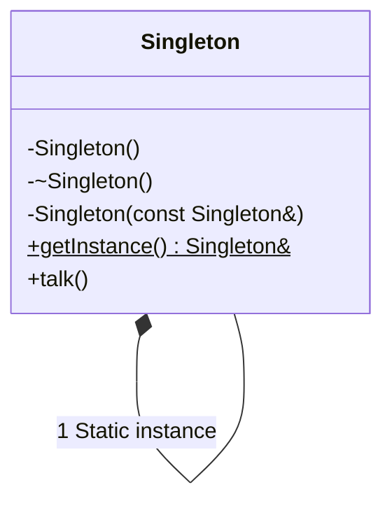

# Singleton Pattern (Simple)

```mermaid
classDiagram
    class Singleton {
        -Singleton()
        -~Singleton()
        -Singleton(const Singleton&)
        +getInstance()$ Singleton&
        +talk()
    }

    %% We move the "1" into the label to avoid the visual bug with recursive arrows
    Singleton *-- Singleton : 1 Static instance
```
