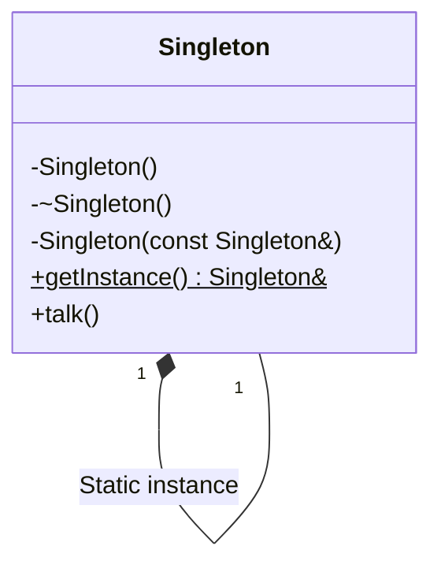

# Singleton Pattern (Simple)

```mermaid
classDiagram
    class Singleton {
        -Singleton()
        -~Singleton()
        -Singleton(const Singleton&)
        +getInstance()$ Singleton&
        +talk()
    }

    %% The class maintains a single instance of itself
    Singleton "1" *-- "1" Singleton : Static instance
```
