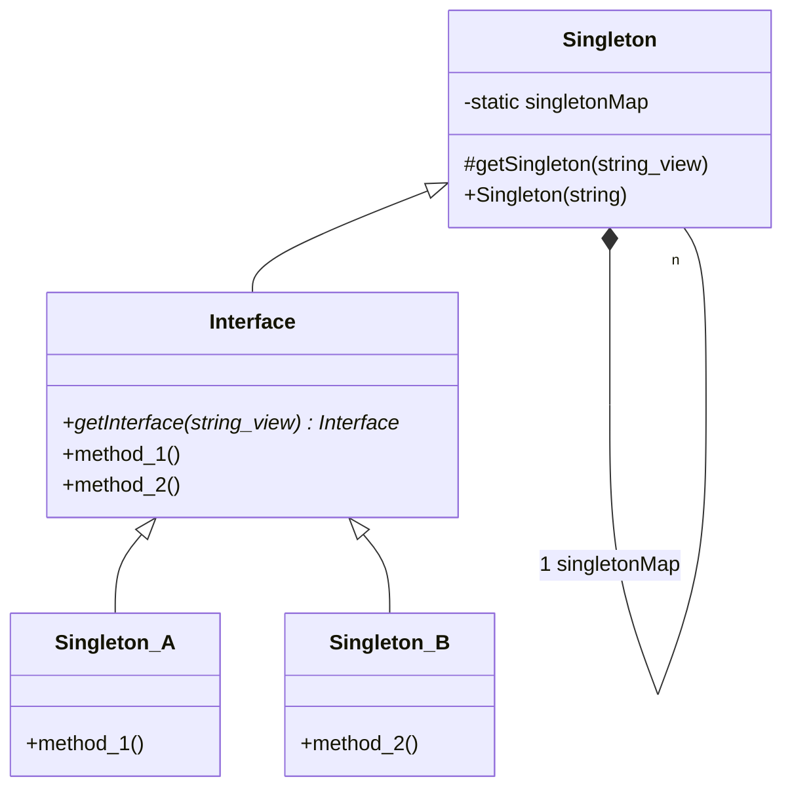

# Singleton Pattern (with Registry)

```mermaid
classDiagram
   class Singleton {
      -static singletonMap
      #getSingleton(string_view)
      +Singleton(string)
   }

   class Interface {
      +getInterface(string_view) Interface*
      +method_1()
      +method_2()
   }

   class Singleton_A {
      +method_1()
   }

   class Singleton_B {
      +method_2()
   }

   %% Inheritance hierarchy
   Singleton <|-- Interface
   Interface <|-- Singleton_A
   Interface <|-- Singleton_B

   %% The Registry Map: Singleton manages multiple instances of itself
   Singleton *-- "n" Singleton : 1 singletonMap
```
