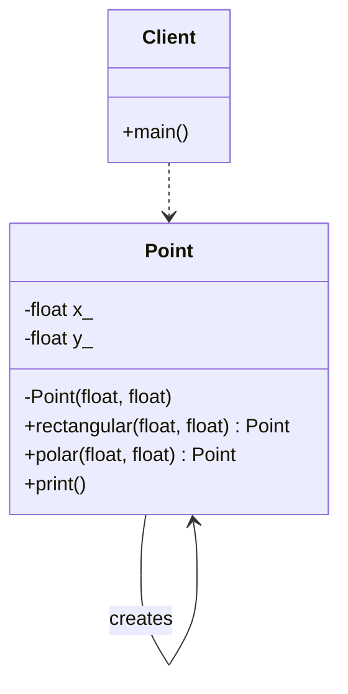

# Named Constructors (Same Parameters)

```mermaid
classDiagram
   class Point {
      -float x_
      -float y_
      -Point(float, float)
      +rectangular(float, float) Point
      +polar(float, float) Point
      +print()
   }

   class Client {
      +main()
   }

   %% Dependency: No numbers used as per our symbology
   Point --> Point : creates
   Client ..> Point
```
