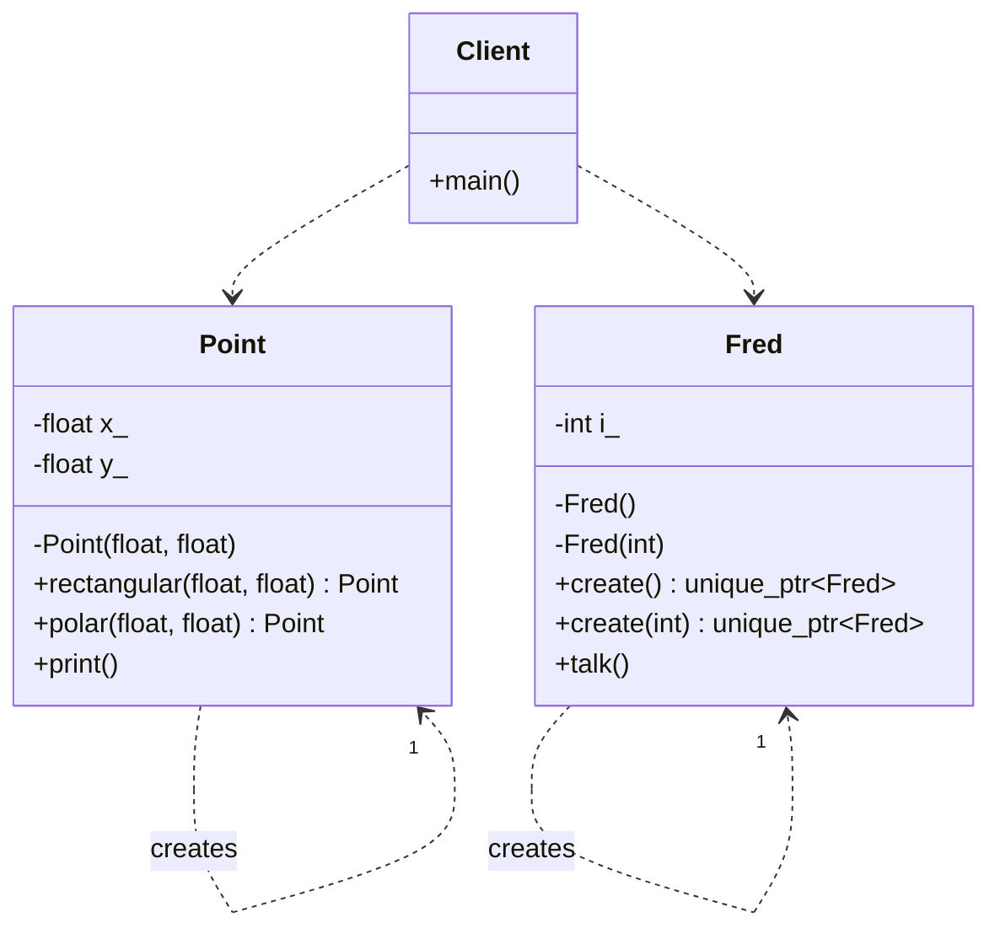

# Named Constructors Pattern

```mermaid
classDiagram
   class Point {
      -float x_
      -float y_
      -Point(float, float)
      +rectangular(float, float) Point
      +polar(float, float) Point
      +print()
   }

   class Fred {
      -int i_
      -Fred()
      -Fred(int)
      +create() unique_ptr~Fred~
      +create(int) unique_ptr~Fred~
      +talk()
   }

   class Client {
      +main()
   }

   %% The static methods depend on the class they instantiate
   Point ..> "1" Point : creates
   Fred ..> "1" Fred : creates

   %% The Client interacts with the static factories
   Client ..> Point
   Client ..> Fred
```
