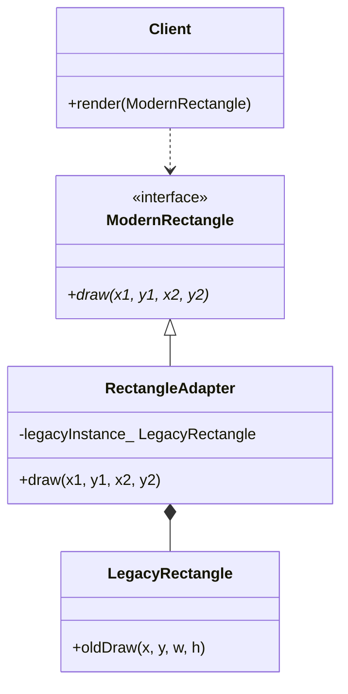

# Adapter Pattern

```mermaid
classDiagram
   class LegacyRectangle {
      +oldDraw(x, y, w, h)
   }

   class ModernRectangle {
      <<interface>>
      +draw(x1, y1, x2, y2)*
   }

   class RectangleAdapter {
      -legacyInstance_ LegacyRectangle
      +draw(x1, y1, x2, y2)
   }

   class Client {
      +render(ModernRectangle)
   }

   %% Inheritance (Is_a) - No numbers
   ModernRectangle <|-- RectangleAdapter

   %% Composition (Has_a)
   RectangleAdapter *-- LegacyRectangle

   %% Dependency - No numbers
   Client ..> ModernRectangle
```
