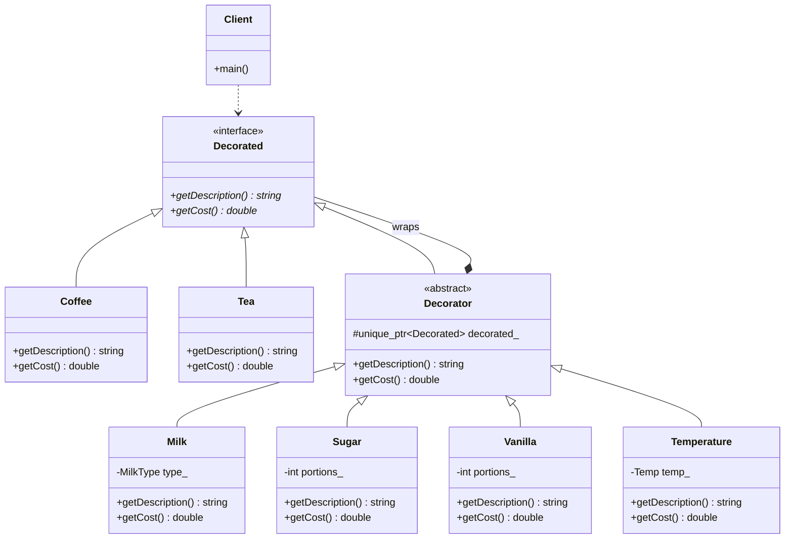

# Decorator Pattern (Advanced)

```mermaid
classDiagram
   class Decorated {
      <<interface>>
      +getDescription()* string
      +getCost()* double
   }

   class Coffee {
      +getDescription() string
      +getCost() double
   }

   class Tea {
      +getDescription() string
      +getCost() double
   }

   class Decorator {
      <<abstract>>
      #unique_ptr~Decorated~ decorated_
      +getDescription() string
      +getCost() double
   }

   class Milk {
      -MilkType type_
      +getDescription() string
      +getCost() double
   }

   class Sugar {
      -int portions_
      +getDescription() string
      +getCost() double
   }

   class Vanilla {
      -int portions_
      +getDescription() string
      +getCost() double
   }

   class Temperature {
      -Temp temp_
      +getDescription() string
      +getCost() double
   }

   class Client {
      +main()
   }

   %% Inheritance (Is_a) - No numbers
   Decorated <|-- Coffee
   Decorated <|-- Tea
   Decorated <|-- Decorator
   Decorator <|-- Milk
   Decorator <|-- Sugar
   Decorator <|-- Vanilla
   Decorator <|-- Temperature

   %% The "Is a" and "Has a" core logic
   %% Composition (Has_a) - Multiplicity "1" at the end
   Decorator *-- Decorated : wraps

   %% Dependency - No numbers
   Client ..> Decorated
```
