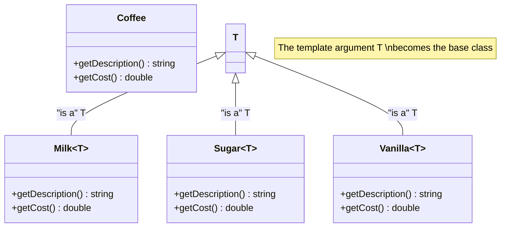

# Decorator Pattern (Static / Mixin Inheritance)

### Design Note:
In this version, the 'is a' relationship is established at compile-time. There
is no 'has a' relationship because the decorator does not hold a pointer to
another object; it literally inherits the functionality of the class passed as a
template parameter.