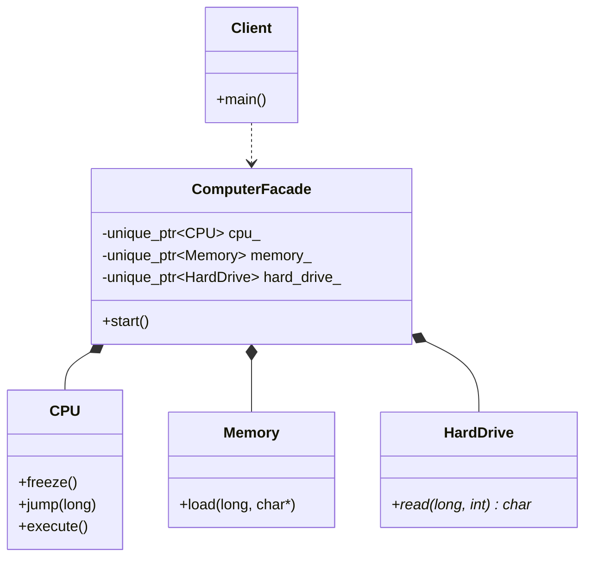

# Facade Pattern

```mermaid
classDiagram
   class CPU {
      +freeze()
      +jump(long)
      +execute()
   }

   class HardDrive {
      +read(long, int) char*
   }

   class Memory {
      +load(long, char*)
   }

   class ComputerFacade {
      -unique_ptr~CPU~ cpu_
      -unique_ptr~Memory~ memory_
      -unique_ptr~HardDrive~ hard_drive_
      +start()
   }

   class Client {
      +main()
   }

   %% The Facade owns and manages the subsystem components
   ComputerFacade *-- CPU
   ComputerFacade *-- Memory
   ComputerFacade *-- HardDrive

   %% The Client only interacts with the simple interface
   Client ..> ComputerFacade
```
