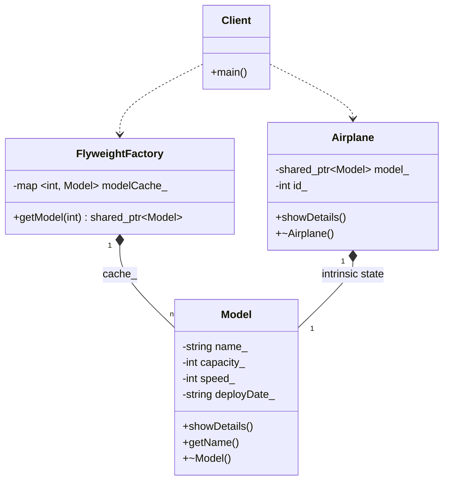

# FLYWEIGHT PATTERN (STRUCTURAL)

## Intent
The Flyweight pattern is used to minimize memory usage by sharing as much 
data as possible with other similar objects. It is a technique for 
efficiently supporting a large number of fine-grained objects.

## The Problem
When an application needs to create a massive number of objects, the memory 
footprint can become unsustainable. If many of these objects share common 
data, we are wasting memory by storing that redundant data in every single 
instance.

## The Solution
We separate the object's state into two parts:
1. **Intrinsic State:** 
Invariant data shared across many objects. This is stored inside the 
'Flyweight' object. It is independent of the context.
2. **Extrinsic State:** 
Context-specific data that varies between instances. This is passed to 
the Flyweight methods by the client object when needed.

## Our Example
This folder illustrates a manual implementation using a 'FlyweightFactory'.
It shows how to use shared 'Model' objects for 'Airplane' instances, preventing
redundant storage of model names, capacities, and speeds.

## Key Benefits
- **Memory Efficiency:** Dramatically reduces the RAM footprint when dealing 
with thousands or millions of similar objects.
- Shared State: Centralizes invariant data, ensuring consistency across 
all instances.
- **Separation of Concerns:** Clearly distinguishes between what is common 
(intrinsic) and what is specific (extrinsic).

## Trade-offs:
- **Complexity:** The code becomes slightly more complex as you need to manage 
a factory and ensure that extrinsic state is passed correctly.
- **Performance:** There might be a slight CPU cost to look up the shared 
object in the factory, trading CPU cycles for RAM savings.

---
# Flyweight Pattern

