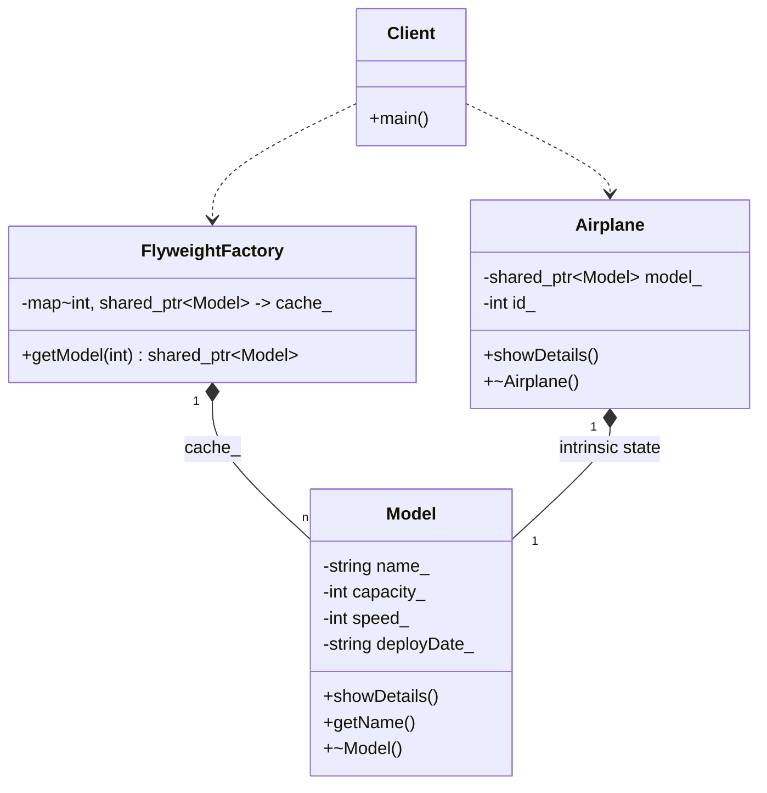

# Flyweight Pattern

```mermaid
classDiagram
   class Model {
      -string name_
      -int capacity_
      -int speed_
      -string deployDate_
      +showDetails()
      +getName()
      +~Model()
   }

   class FlyweightFactory {
      -map~int, shared_ptr~Model~ -> cache_
      +getModel(int) shared_ptr~Model~
   }

   class Airplane {
      -shared_ptr~Model~ model_
      -int id_
      +showDetails()
      +~Airplane()
   }

   class Client {
      +main()
   }

   %% The Factory owns and manages the pool of shared models
   FlyweightFactory "1" *-- "n" Model : cache_

   %% Many Airplanes share the same single Model instance
   Airplane "1" *-- "1" Model : intrinsic state

   %% Client interacts with the factory to get models and creates airplanes
   Client ..> FlyweightFactory
   Client ..> Airplane
```
