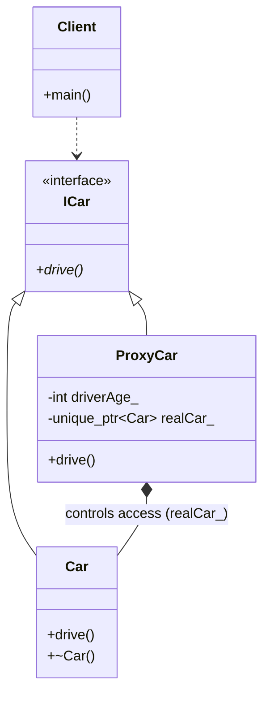

# PROXY PATTERN (STRUCTURAL)

## Intent
The Proxy pattern provides a surrogate or placeholder for another object 
to control access to it. It acts as an interface to something else, 
whether it be a network connection, a large object in memory, a file, 
or a resource that is expensive to duplicate or access.

## The Problem
Clients often need to interact with objects that are either
1. Too heavy to instantiate immediately (Virtual Proxy).
2. Restricted or sensitive (Protection Proxy).
3. Located in a different address space (Remote Proxy).
Directly exposing these objects to the client creates tight coupling 
and inefficiency.

## The Solution
Introduce a Proxy class that implements the same interface as the real 
object. The Proxy:
- Intercepts requests from the client.
- Performs logic (access control, lazy loading, logging).
- Decides whether to forward the request to the real object or handle 
it directly.

## Our Example (Virtual & Protection Proxy):
- **Interface (ICar):** Defines the 'drive' method.
- **Real Subject (Car):** The heavy object that actually performs the work.
- **Proxy (ProxyCar):** Controls access based on the driver's age and 
implements 'Lazy Initialization'—the real car is only created when 
the driver is old enough and actually calls the 'drive' method.

## Key Benefits
- **Lazy Initialization:** Defers the creation of expensive objects until 
absolutely necessary, saving memory and startup time.
- **Access Control:** Centralizes security logic (e.g., driver age check).
- **Transparency:** The client interacts with the ICar interface, making it 
unaware of whether it is communicating with a Proxy or the Real Subject.

## Modern C++ Note:
We use 'std::unique_ptr' for memory management and 'mutable' for the 
lazy-initialized member, allowing 'drive()' to remain a 'const' method 
while still performing the internal initialization.

---
# Proxy Pattern

