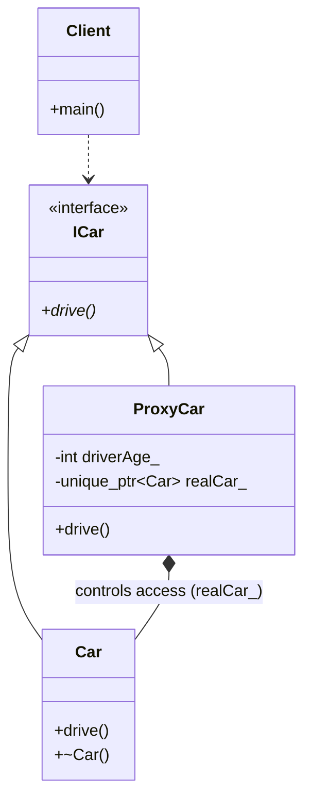

# Proxy Pattern

```mermaid
classDiagram
   class ICar {
      <<interface>>
      +drive()*
   }

   class Car {
      +drive()
      +~Car()
   }

   class ProxyCar {
      -int driverAge_
      -unique_ptr~Car~ realCar_
      +drive()
   }

   class Client {
      +main()
   }

   %% Inheritance (Is_a) - No numbers
   ICar <|-- Car
   ICar <|-- ProxyCar

   %% Composition (Has_a)
   %% The Proxy owns and manages the lifecycle of the Real Subject
   ProxyCar *-- Car : controls access (realCar_)

   %% Dependency - No numbers
   Client ..> ICar
```
