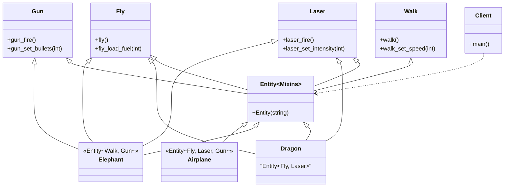

# Mixin Pattern (Simple)

### Design Note:
In the Simple Mixin version, the 'Entity' class provides a way to combine
independent features (Mixins) at compile-time. The final objects (Dragon,
Elephant, Airplane) are flat structures that contain all the methods and data
members of their respective base Mixins simultaneously.