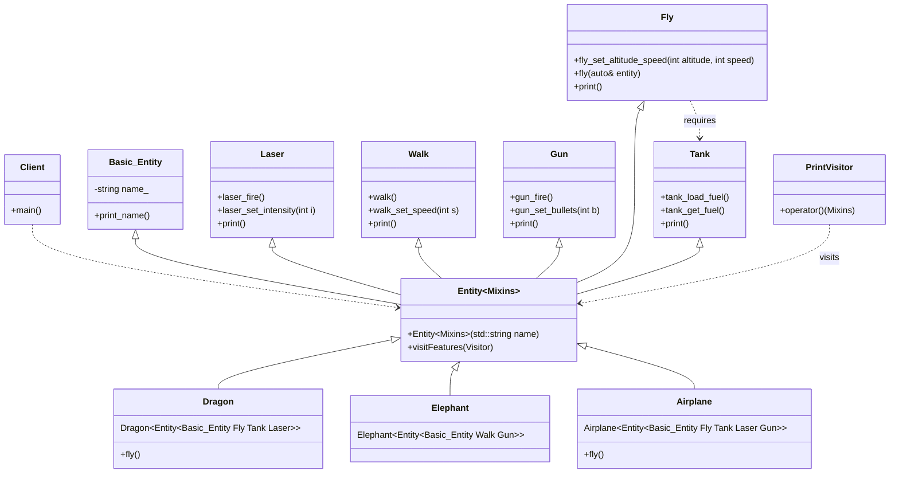

# Mixin Pattern (Advanced)

### Design Note:
In this pattern, the 'Entity' class inherits directly from the variadic pack of
'Mixins'. This is 'Static Composition' through Multiple Inheritance. Note that
'Fly' has a dependency on 'Tank', which is resolved at compile-time when both
are mixed into the same Entity.