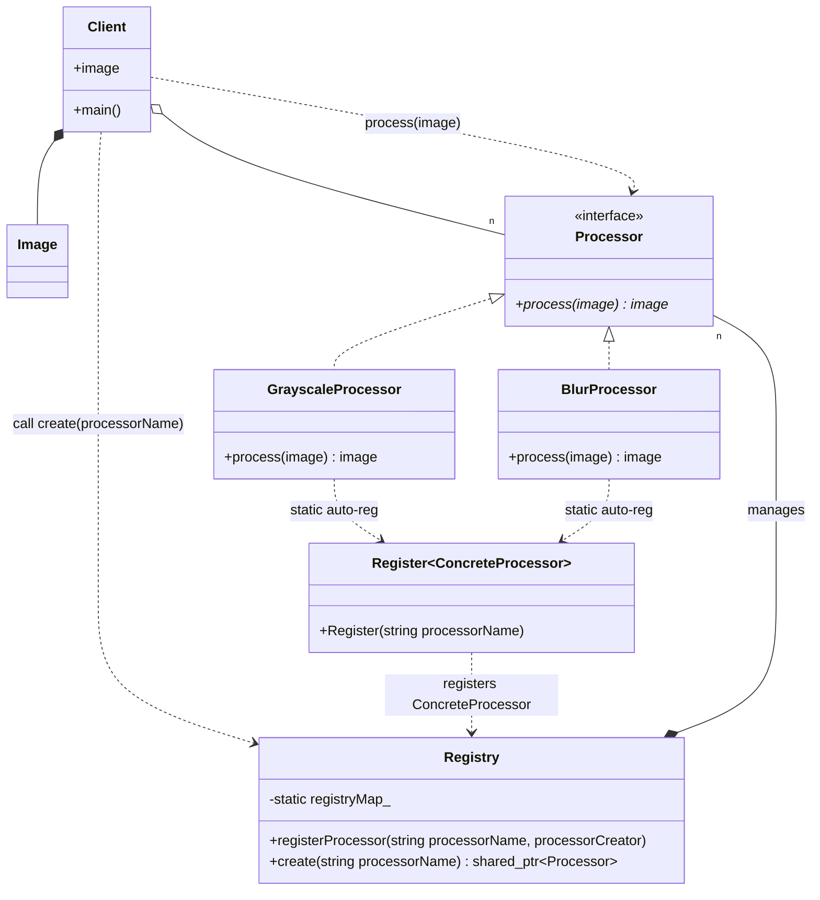

# Registry Pattern

### Design Note:
This diagram highlights the decoupled nature of the Registry. The 'Client' has
no direct link to 'GrayscaleProcessor' or 'BlurProcessor'. The 'Register' helper
facilitates a "push" registration during static initialization, populating the
Registry's internal map before the 'main' function starts.