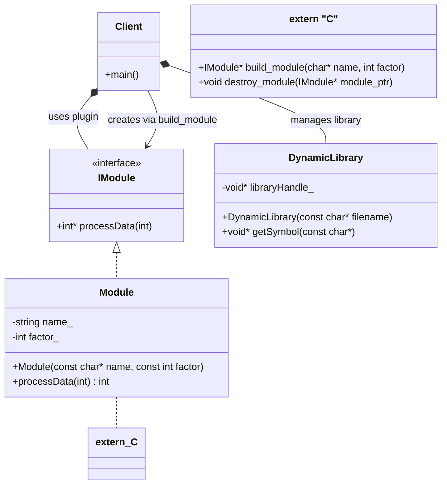

# Module Loader / Plugin Pattern

### Design Note:
This diagram illustrates the separation between the 'Host' (Client and
DynamicLibrary) and the 'Plugin' (Module). The Client only has a compile-time
dependency on the 'IModule' interface. The concrete 'Module' class is loaded at
runtime from the Shared Object (.so), and its lifecycle is managed through a
smart pointer with a custom deleter provided by the library's symbols.
