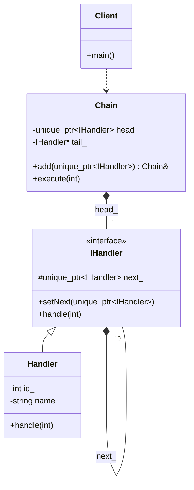

# Chain of Responsibility Pattern

### Design Note:
This diagram illustrates a linked-list structure. The 'Chain' class acts as a
manager that simplifies the linking process (the builder). Each 'Handler' has a
composition relationship with the next 'IHandler' in the sequence. If a request
cannot be processed by the current node, it is delegated via the 'next_' pointer
until it reaches the end of the chain.
