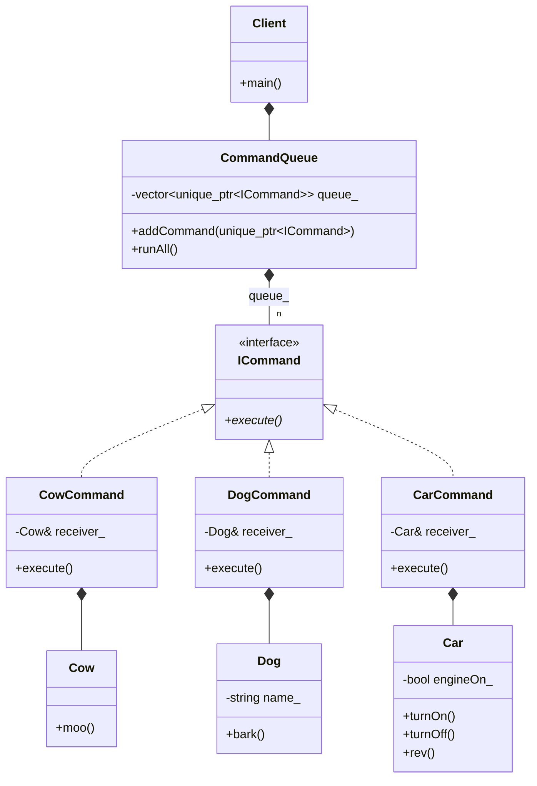

# COMMAND PATTERN: TRADITIONAL GOF

## Overview
This implementation follows the classic Gang of Four (GoF) approach using 
dynamic polymorphism.

## Key Features
- **Abstract Interface:** A 'Command' base class with a virtual 'execute()' method.
- **Concrete Commands:** Classes like 'CowCommand' or 'CarCommand' that 
  hold a reference to a 'Receiver' and implement the specific action.
- **Invoker (CommandQueue):** A generic invoker that manages a 
  'std::vector<std::unique_ptr<Command>>'.

## Why use this version?
This is the standard approach when you need a highly extensible system where 
new commands can be added by third-party developers through inheritance, 
maintaining a clean object-oriented structure.

---
# Command Pattern (GoF Version)

### Design Note:
In this traditional version, each 'Command' object acts as a bridge. It knows
which 'Receiver' method to call. The 'CommandQueue' remains completely
decoupled from the 'Receivers', as it only interacts with the 'Command'
interface to trigger actions.