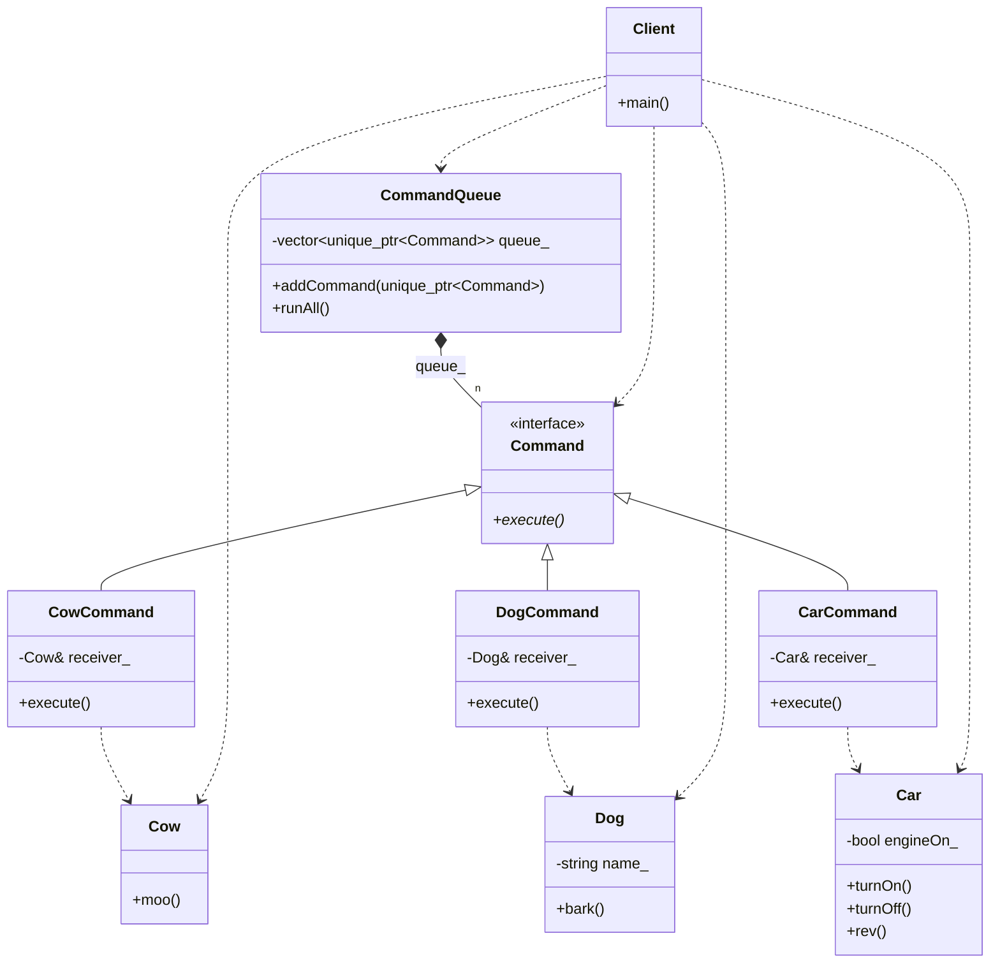

# Command Pattern (GoF Version)

### Design Note:
In this traditional version, each 'Command' object acts as a bridge. It knows
which 'Receiver' method to call. The 'CommandQueue' (Invoker) remains completely
decoupled from the 'Receivers', as it only interacts with the 'Command'
interface to trigger actions.