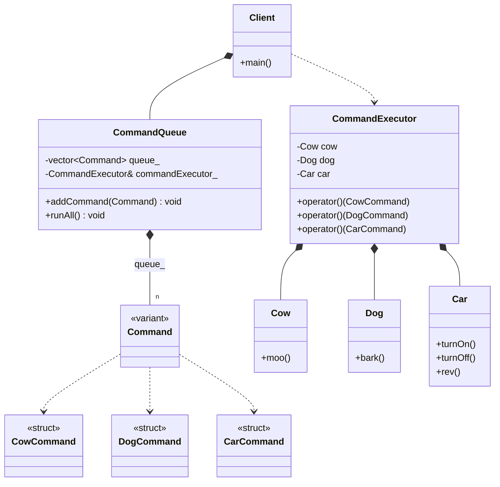

# COMMAND PATTERN: MODERN VARIANT (C++17)

## Overview
This version replaces class inheritance with 'std::variant' and 'std::visit'. 
Commands are no longer classes, but simple "Data Labels".

## Key Features
- **Non-Intrusive:** Commands are plain structs. They do not need to inherit 
  from any base class.
- **Value Semantics:** Commands are stored by value in the queue, eliminating 
  the need for 'std::unique_ptr' and heap allocations.
- **Centralized Logic:** The 'CommandExecutor' acts as a Visitor, gathering 
  all execution logic in one place.

## Why use this version?
Use this approach for high-performance systems where you want to avoid the 
overhead of virtual functions and memory fragmentation. It provides 
"Static Safety", as the compiler ensures all commands are handled by the 
executor.

---
# Command Pattern (Modern Variant)

### Design Note:
In this modern approach, the 'Command' is a type-safe union (std::variant) of
plain structs. The 'CommandExecutor' holds references to the receivers,
establishing a 'Has_a' relationship (Composition). The Client manages a
collection of commands by value and depends on the Executor to process them via
'std::visit'.
