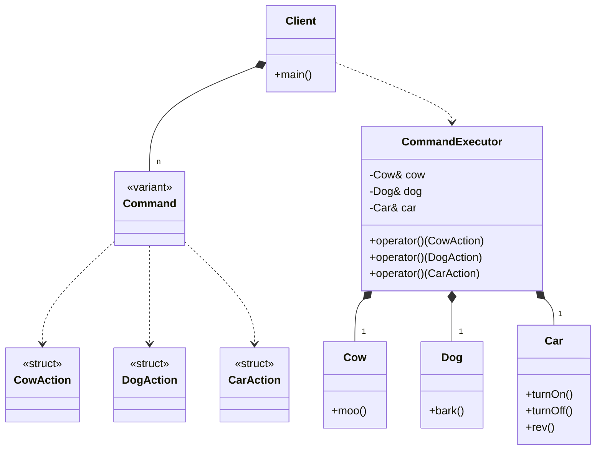

# Command Pattern (Modern Variant)

### Design Note:
In this modern approach, the 'Command' is a type-safe union (std::variant) of
plain structs. The 'CommandExecutor' holds references to the receivers,
establishing a 'Has_a' relationship (Composition). The Client manages a
collection of commands by value and depends on the Executor to process them via
'std::visit'.
