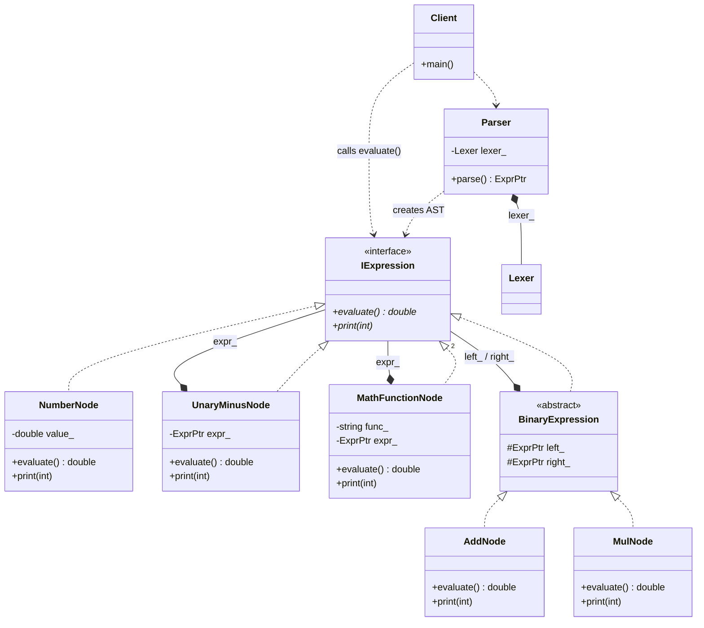

# Interpreter Pattern (GoF AST Version)

### Design Note:
In the GoF AST version, the architecture is hierarchical and recursive. The 
'Parser' performs a recursive descent to translate the input string into a 
tree of polymorphic objects (nodes) in memory. Unlike the Stack Machine, there 
is no bytecode or Virtual Machine; evaluation is a decentralized process 
triggered by calling 'evaluate()' on the root node, which recursively 
calculates the result by traversing its children. This design prioritizes 
structural clarity and extensibility over raw execution speed.
