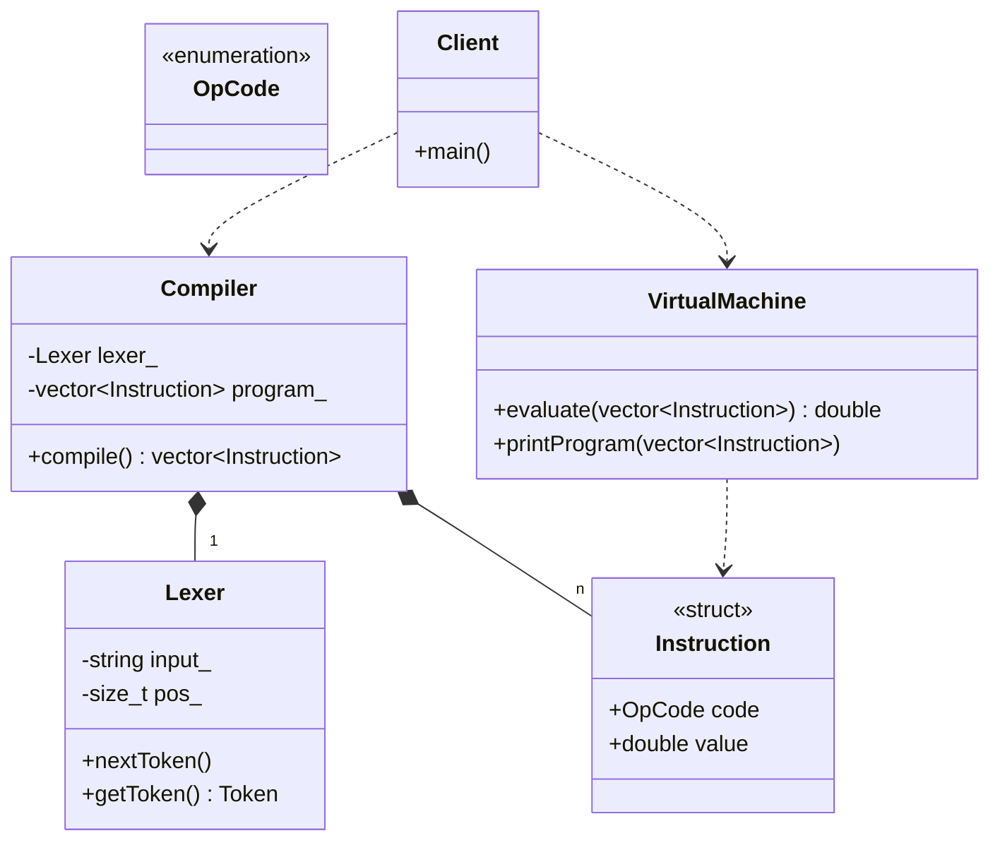

# Interpreter Pattern (Stack Machine Version)

### Design Note:
In the Stack Machine version, the architecture is linear. The 'Compiler'
performs a recursive descent to translate the input string into a flat sequence
of 'Instruction' objects (Bytecode). This bytecode is stored in a vector and
then passed to the 'VirtualMachine', which executes it using an internal
stack. Unlike the AST version, this design prioritizes execution speed and
memory efficiency over object-oriented structure.
