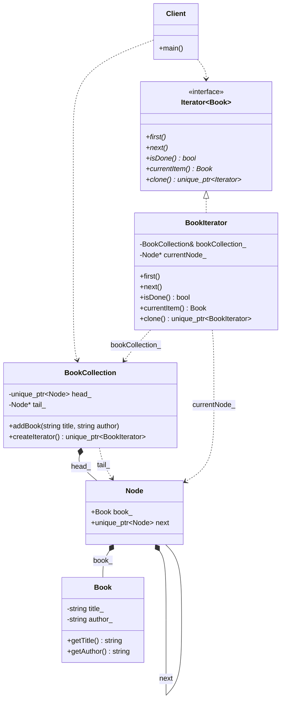

# Iterator Pattern (GoF Version)

### Design Note:
This diagram illustrates the classic decoupled approach. The 'BookCollection'
(Aggregate) is responsible for storing the data in a linked-list of 'Nodes',
while the 'BookIterator' manages the traversal state. By providing a 'clone()'
method, we allow multiple independent iterators to exist and duplicate their
positions efficiently, as shown in the author's search simulation.
