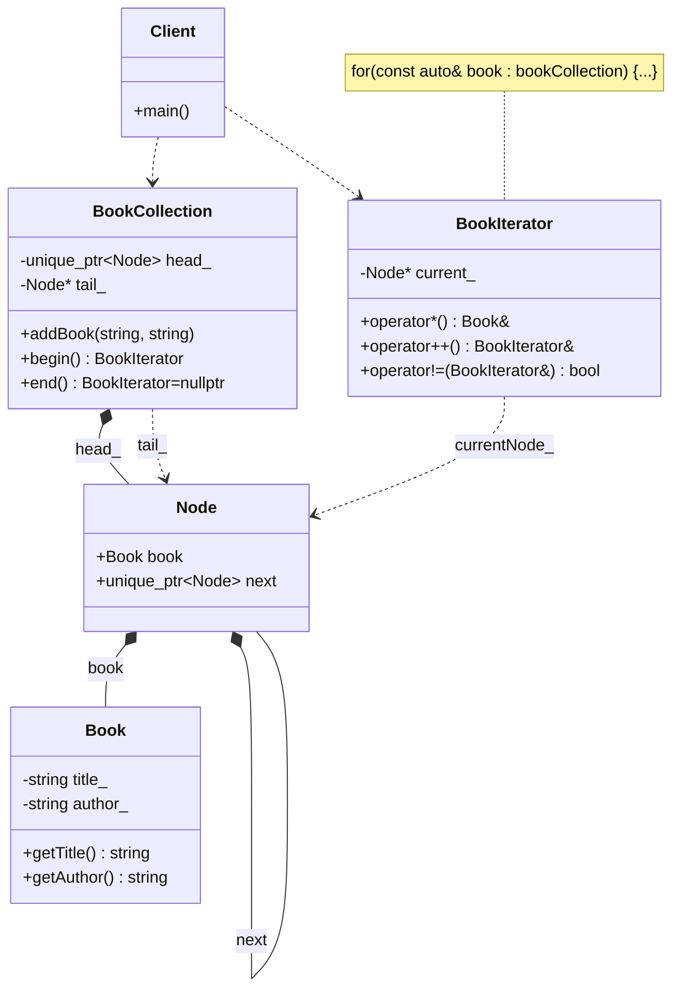

# Iterator Pattern (Modern STL Version)

### Design Note:
In the Modern C++ (STL) version, the Iterator pattern is implemented without
inheritance. The 'BookCollection' provides 'begin()' and 'end()' methods that
return 'BookIterator' instances. The C++ compiler uses these methods and the
overloaded operators (*, ++, !=) to enable the 'Range-based for loop'
syntax. This approach follows the Zero-Overhead Principle, as all calls are
resolved at compile-time without virtual table lookups.
