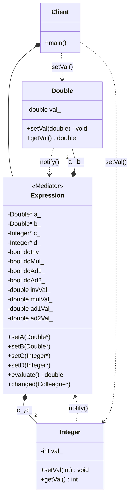

# MEDIATOR PATTERN (BEHAVIORAL)

## Intent
Define an object that encapsulates how a set of objects interact. Mediator 
promotes loose coupling by keeping objects from referring to each other 
explicitly, and it lets you vary their interaction independently.

## The Problem
In a complex system, objects often need to communicate with many other 
objects. If they interact directly with each other, the system becomes a 
tightly coupled "web" of dependencies (spaghetti code). Each object has 
to know in detail about how to interact with the others, making the system 
brittle, hard to test, and difficult to refactor.

## The Solution
Rather than interacting directly, objects (Colleagues) ask a central 
object (the Mediator) to interact on their behalf. 
- The Mediator encapsulates the interaction between the objects and makes 
them independent of each other.
- The coupling between objects goes from tight and brittle to loose and agile.
- Colleagues only need to know about the Mediator, reducing the complexity 
of their classes.

## Our Example (The Equation Cache Coordinator):
This example evaluates the equation ```(1/a) * (b+c) + d```.
Assume that the mathematical operations are highly expensive. The job of 
the Mediator (Equation) is to coordinate the changes in the Numbers ```(a, b,
c, d)``` to execute as few operations as possible. 
When a Colleague changes its value, it notifies the Mediator. The Mediator 
then recalculates only the parts of the equation that were affected.

## Note on Memory Management
In this specific example, the Mediator and the Colleagues are instantiated 
in the same local scope (the stack in 'main'). Therefore, their lifespans 
are strictly bound and guaranteed. Because of this static nature, we use 
raw pointers and references. 
(In highly dynamic systems where Colleagues are created/destroyed at runtime 
on the heap, a combination of std::shared_ptr for ownership and std::weak_ptr 
to break circular dependencies would be required).

## Key Benefits
- **Decoupling:** Colleagues are completely decoupled from one another.
- **Centralized Control:** Interaction logic is isolated in one place, making 
it easier to alter or extend.
- **Simplified Protocols:** Objects only need to communicate with the Mediator.

---
# Mediator Pattern



### Design Note:
In this implementation, the 'Expression' (Mediator) acts as a central coordinator
for the calculation (1/a) * (b+c) + d. Instead of Colleagues interacting with
each other, they notify the Mediator when their values change. The Mediator then
decides which parts of the calculation are "dirty" and need to be recomputed,
effectively managing an internal cache of the equation's steps.
