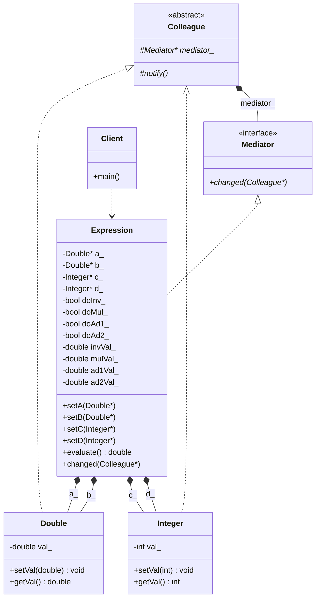

# Mediator Pattern

### Design Note:
In this implementation, the 'Expression' (Mediator) acts as a central coordinator
for the calculation (1/a) * (b+c) + d. Instead of Colleagues interacting with
each other, they notify the Mediator when their values change. The Mediator then
decides which parts of the calculation are "dirty" and need to be recomputed,
effectively managing an internal cache of the equation's steps.
