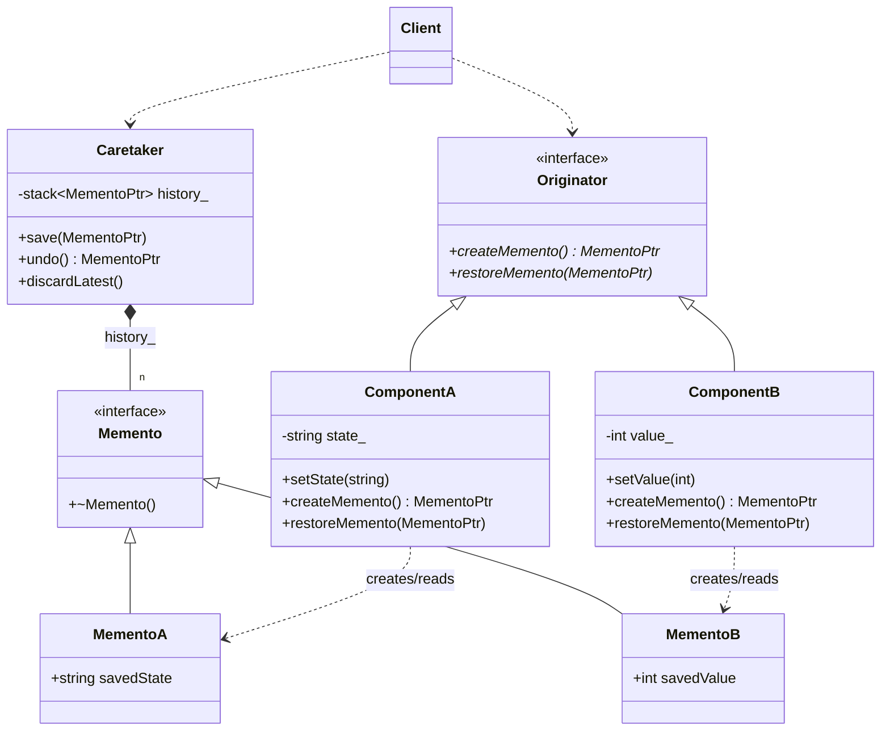

# Memento Pattern (GoF Version)

### Design Note:
In the Classic GoF version, encapsulation is key. 'ComponentA' and 'ComponentB'
are the only ones capable of seeing inside their respective Mementos ('MementoA'
and 'MementoB'). The 'Caretaker' treats all mementos as opaque 'Memento' base
pointers, fulfilling its role as a safekeeper without violating the internal
state of the components.
