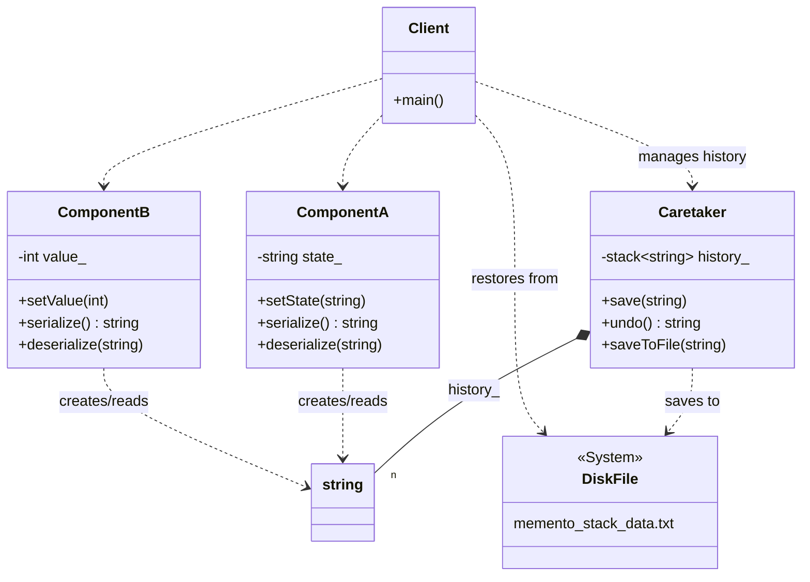

# Memento Pattern (String Serialization Version)

### Design Note:
In this modern pragmatic version, the Memento is simplified into a
'std::string'. The 'Caretaker' acts as a persistence manager, holding a stack of
these strings in memory and providing the ability to dump them into a
'DiskFile'. The simulation demonstrates a "Fresh Restart" where the memory is
cleared and the state is perfectly reconstructed from the serialized data on
disk.
