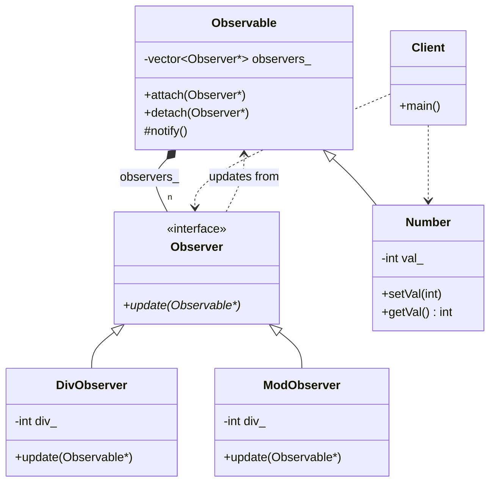

# Observer Pattern (Classic GoF Version)

### Design Note:
In this classic version, the 'Observable' class maintains a collection of
'Observer' pointers. When a state change occurs, the 'notify()' method iterates
through the list and calls 'update(this)'. Since the 'Observer' interface only
knows about the base 'Observable' class, concrete observers like 'DivObserver'
must cast the pointer back to 'Number' to retrieve the current value.
