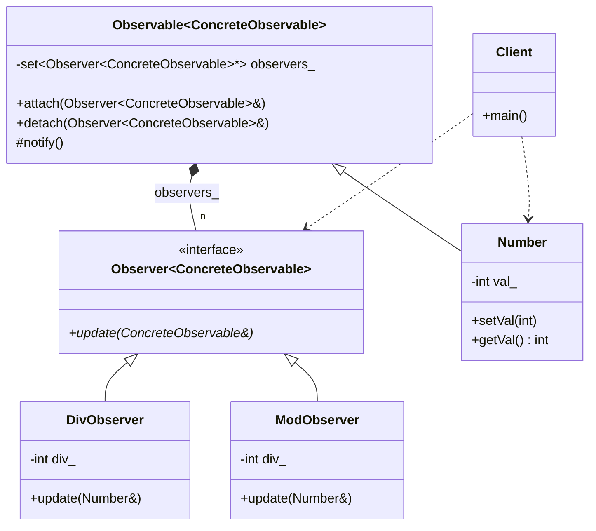

# Observer Pattern (CRTP Basic Version)

### Design Note:
This implementation leverages the Curiously Recurring Template Pattern
(CRTP). By passing 'Number' as a template argument to the base classes, the
'Observer' interface becomes type-aware at compile-time. The 'update(Number&)'
method provides direct access to the concrete observable's state, improving both
performance (by allowing inlining) and type safety (by eliminating raw pointer
casts).
