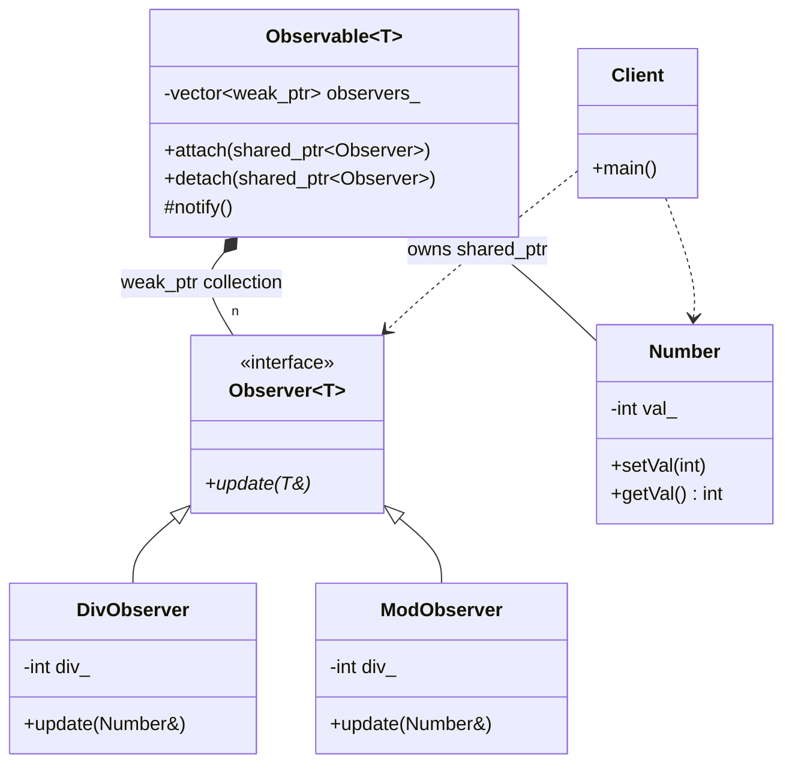

# Observer Pattern (CRTP with Smart Pointers)

### Design Note:
This version introduces memory safety into the CRTP Observer. The Observable
maintains a collection of 'std::weak_ptr' to its observers. This prevents
circular dependencies (leaks) and ensures that if an observer is destroyed by
the Client, the Observable won't attempt to access invalid memory. During
'notify()', each pointer is temporarily locked to verify the observer's
existence before calling 'update()'.
